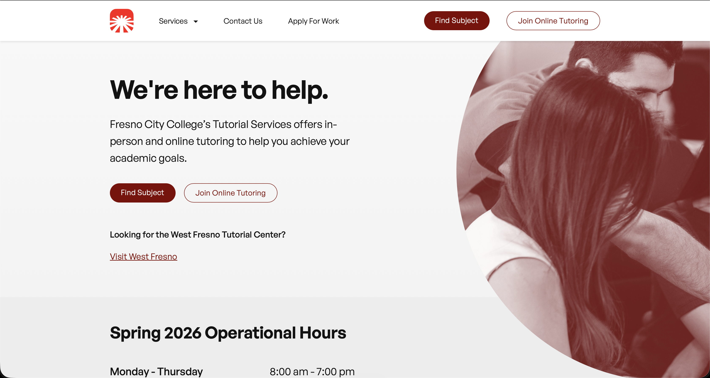
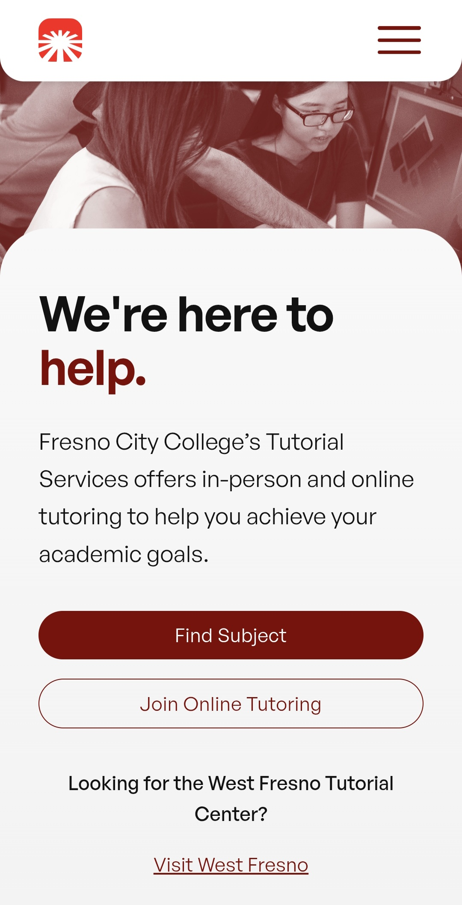
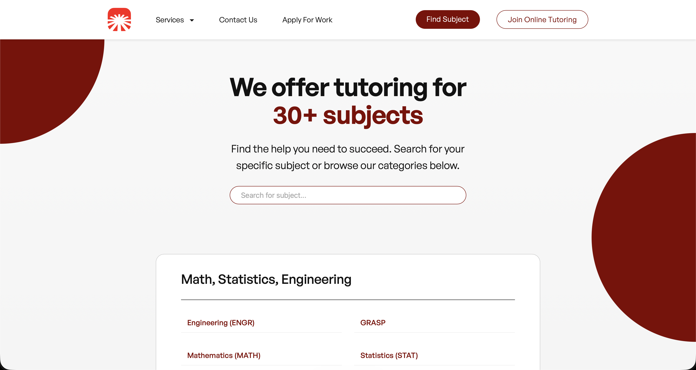

# Tutorial Services Website Redesign (Mockup)

🔗 **Live Demo:** https://fcc-tutorial-services-prototype.netlify.app 
📂 **Repository:** https://github.com/darren2812/tutorial-center-website-mockup 

## Overview
This is an independent mock redesign of Fresno City College's Tutorial Services website which aims to make navigation clearer and improve information hierarchy and text legibility, and incorporate a responsive design across multiple screen sizes. Schedule data is fetched using Google Apps Script and parsed in the frontend, allowing users to search for a specific course, instructor, or tutoring type.

Original Website:
https://sites.google.com/view/fcc-tutorial-services/fcc-tutorial-services-home

The current version presents challenges in distinguishing between the different departments within Fresno City College's Tutorial Services. 

## Features
- Improved information hierarchy through grouping related information together
- Bolder hero redesign with clear CTA buttons
- Templated subject page to accomodate schedules across different subjects
- Search functionality to filter subjects and individual course schedules

## Tech Stack
- HTML5
- CSS3
- JavaScript

## Screenshots

### Desktop Home

### Mobile Home

  

### Subjects Page Desktop

## What I Learned
- Designing systems around real user needs
- Refactoring early to ensure that code is maintainable
- Working with stakeholders in refining the product
